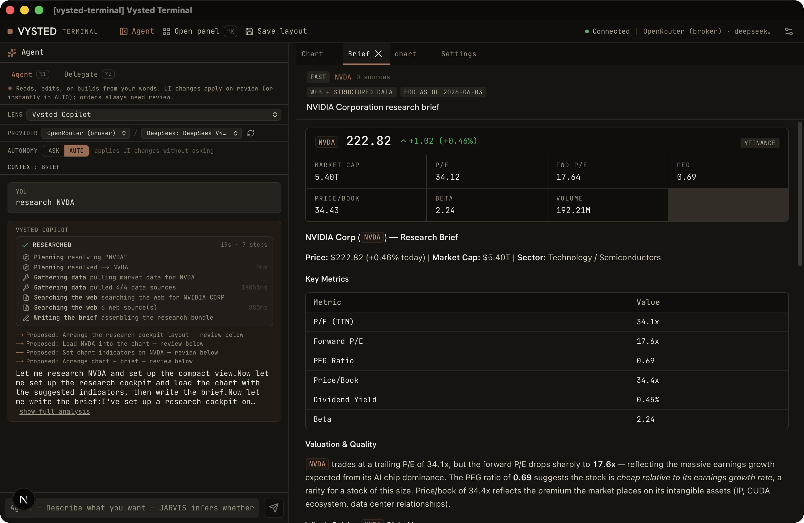
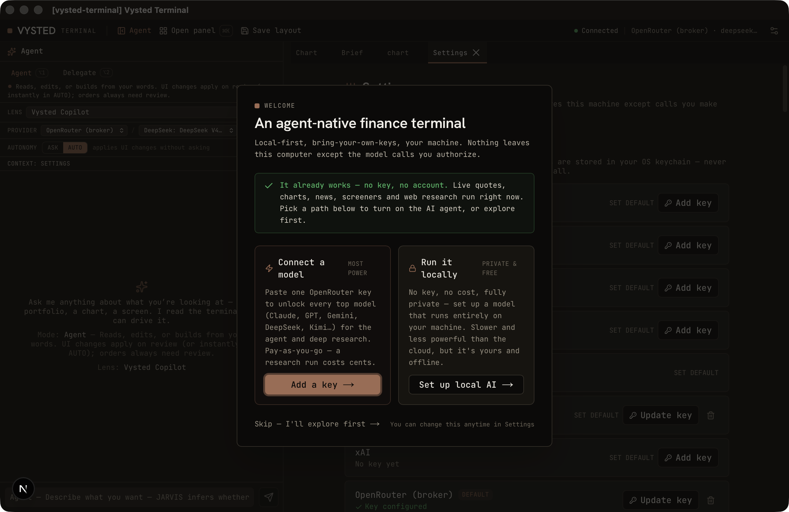

# Vysted Terminal

Open-source, AI-native desktop finance terminal — Bloomberg-level data coverage,
agent-assisted, **local-first**, and **bring-your-own-keys**. No account, no hosted
backend, no telemetry: data and secrets stay on your machine.

> **Redesign in flight.** Vysted is being reframed into an **agent-native finance
> workspace** — a hybrid of a dense pro command-station and an agent-first assistant
> that drives the terminal for you. See **[`docs/CURRENT_STATE.md`](./docs/CURRENT_STATE.md)**
> for an honest inventory of what exists today and
> **[`specs/001-agent-native-redesign/spec.md`](./specs/001-agent-native-redesign/spec.md)**
> for where it's headed.

<p align="center">
  
  <br />
  <em>Ask the agent to “research NVDA” — a visual, cited brief lands in the cockpit (metric cards, key-metrics table, written analysis) beside a live research trace.</em>
</p>

---

## Overview

Vysted Terminal is a Tauri desktop app with three cooperating processes on one machine
(loopback only): a **Rust core** (windowing, OS keychain, sidecar lifecycle), a
**Next.js static-export frontend** (the panel cockpit), and a **Python FastAPI sidecar**
(data + AI compute), plus two bundled MCP subprocesses (OpenBB fundamentals/macro,
SEC EDGAR filings).

What's in the box today:

- **A multi-panel cockpit** (dockview) — Chart (50 server-computed indicators + drawing
  tools), Watchlist, News (RSS + optional NewsAPI, sentiment), Portfolio, Equity
  Overview, plus Macro, SEC Filings, Earnings, Analyst Ratings, Screener, Quant
  (QuantLib), Backtest, and a Node Editor / workflow surface.
- **An agentic AI copilot** — a real tool-use loop in the sidecar: the model calls
  read/host-action tools to pull data and drive the terminal. 13 first-party agents
  (a terminal-aware copilot + 12 investor personas) plus user-authored custom agents.
- **BYOK across 7 LLM providers** (Anthropic, OpenAI, Gemini, Groq, Ollama, DeepSeek,
  xAI). Keys live in the OS keychain and never persist to disk.
- **Read-only broker connect** — genuine Kite Connect OAuth + read-only account /
  positions / P&L (Kite, Dhan, Angel One). A §6.5 execution-safety layer (paper-default,
  kill-switch, append-only audit log) exists in code; **order execution is not enabled**.
- **A plugin platform** — one serializable `VystedPlugin` contract (six capabilities:
  data, panels, commands, agents, nodes, control plane) so the terminal is extensible.
- **MCP on both sides** — Vysted proxies bundled MCP data servers _and_ re-exposes its
  own capabilities as MCP tools for external agents (Claude Desktop / Code).

**Honest status:** green on every machine-checkable gate (`pnpm ci-local`, 619 vitest,
942 pytest, §6.5 9/9 safety audit) and broadly tested; **live UX, populated visuals, and
any BYOK/live-broker round-trip are operator-verified, not CI-verified** (the harness
can't drive the webview with real data). The app currently ships **unsigned with no
release pipeline**, and version strings sit at `0.8.0` pending a release cut. See
[`docs/CURRENT_STATE.md`](./docs/CURRENT_STATE.md) for the full works/buggy/deferred map.

---

## Powering the AI: keyless or one key

Vysted works the moment you open it — **no account, no key, no setup.** Live quotes,
charts, news, screeners, and web research (keyless, via DuckDuckGo) all run out of the
box. A first-run flow then offers two ways to turn on the AI agent and deep research,
and you can switch anytime from Settings:

<p align="center">
  
</p>

- **Private & free — a local model.** Vysted fit-scores your machine and sets up a model
  that runs entirely on your computer through [Ollama](https://ollama.com) — no key, no
  cost, fully offline. Slower and less capable than the cloud, but it never leaves your
  machine.
- **Most power — one OpenRouter key.** [OpenRouter](https://openrouter.ai/keys) is a
  single key that brokers every top model (Claude, GPT, Gemini, DeepSeek, Kimi…). Add a
  few dollars of credit; a typical research run costs only cents. The default is a fast,
  cheap, non-thinking agentic model so research never stalls.

Either way, **your keys live in the OS keychain — they never touch disk, and there is no
Vysted server for them to reach.** The app only makes network calls to the data and LLM
providers you configure.

---

## Download & install (macOS, Apple Silicon)

Grab the latest `.dmg` from the
[Releases](https://github.com/techlogist1/vysted-terminal/releases) page (Apple Silicon /
M-series — an Intel build isn't published yet), open it, and drag **Vysted Terminal** to
Applications.

Because the app is **open-source and unsigned** (no paid Apple Developer certificate),
macOS Gatekeeper blocks it on first launch. To open it the first time:

1. Double-click the app — macOS says it "cannot be opened." Click **Done** (do _not_ move
   it to Trash).
2. Open **System Settings → Privacy & Security**, scroll to the bottom, and click
   **Open Anyway** next to the Vysted Terminal notice.
3. Confirm **Open**. macOS remembers the choice — every later launch opens normally.

> The old "right-click → Open" trick no longer works for unsigned apps on macOS 15
> (Sequoia) and later — use **Open Anyway** above. From a terminal you can instead clear
> the quarantine flag directly:
>
> ```bash
> xattr -dr com.apple.quarantine "/Applications/Vysted Terminal.app"
> ```

On first launch the app starts its local data/AI engine (a one-time ~30–90s warm-up while
the bundled engine unpacks); the cockpit populates once it's ready. Everything runs on
`127.0.0.1` — no Python or other runtime needs to be pre-installed.

---

## Prerequisites

| Dependency              | Required version | Notes                                       |
| ----------------------- | ---------------- | ------------------------------------------- |
| Node.js                 | 24+              | LTS or Current                              |
| pnpm                    | 10+              | `npm i -g pnpm`                             |
| Rust (stable toolchain) | latest stable    | `rustup toolchain install stable`           |
| C/C++ build tools       | —                | VS Build Tools 2022 on Windows              |
| Python                  | 3.13+            | Used by the FastAPI sidecar and PyInstaller |

**Windows:** Install [Visual Studio Build Tools 2022](https://visualstudio.microsoft.com/visual-cpp-build-tools/)
with the "Desktop development with C++" workload. WebView2 Runtime must also be present
(ships with Windows 11; downloadable separately for Windows 10).

---

## Local Development

```bash
git clone https://github.com/techlogist1/vysted-terminal.git
cd vysted-terminal
pnpm install
pnpm tauri dev
```

The first `pnpm tauri dev` builds the Python sidecar binaries via PyInstaller before
launching (a one-time ~1–2 minute step; subsequent runs skip it unless sidecar source
changes). Before any release tag, run the CI-parity gate and the binary smoke-test:

```bash
pnpm ci-local                       # lint + format + typecheck + clippy + ruff + tests
node scripts/smoke-test-sidecars.mjs # spawn each sidecar binary, probe /health + MCP bind
```

---

## Project Layout

| Path         | Contents                                                                 |
| ------------ | ------------------------------------------------------------------------ |
| `src/`       | Next.js 16 frontend (React 19, TypeScript, Tailwind 4, shadcn/ui)        |
| `src-tauri/` | Rust Tauri 2.x core — windowing, keychain, sidecar lifecycle, IPC        |
| `sidecar/`   | Python 3.13 FastAPI sidecar (+ MCP subprocesses), bundled by PyInstaller |
| `types/`     | Shared TypeScript types; `plugin.ts` is the canonical plugin contract    |
| `plugins/`   | Bundled plugins (example, openbb-mcp, tradesa-v2)                        |
| `styles/`    | Design tokens (`tokens.css`) — Tailwind 4 `@theme` variables             |
| `docs/`      | Architecture docs — start at [`docs/README.md`](./docs/README.md)        |

---

## Contributing

See [CONTRIBUTING.md](./CONTRIBUTING.md).

## License

Free for personal, academic, and open-source use under [AGPL-3.0](./LICENSE). Commercial
use requires a paid license — see [`COMMERCIAL_LICENSE.md`](./COMMERCIAL_LICENSE.md).

## Status

Phases 0–10 merged to `main` (data layer, charting, AI copilot, node editor + backtest,
broker read-only + §6.5 safety, macro/research/QuantLib, integrations hub). The
agent-native redesign is being specified; build follows operator review. See
[`docs/CURRENT_STATE.md`](./docs/CURRENT_STATE.md) and [`docs/BLUEPRINT.md`](./docs/BLUEPRINT.md).
